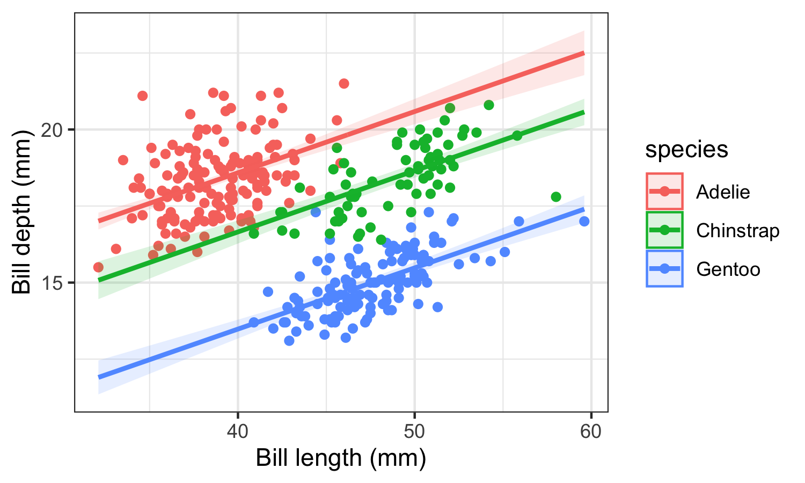

*** 

### Final project proposal (10 pts)

Please prepare a short proposal (<1pg) on your final project idea. The proposal should be written as a `.Rmd` document and pushed out to your personal final_project repo on GitHub. The proposal should include:

- Your name and degree program (BA/BS, MEERM, MS, PhD)
- Title & description of the project
- A description of the data required, and how it will be obtained 
- 3 questions / analysis tasks you will perform on the data in the spirit of the assignments we have been doing.

***

### Final project (90 pts)

The final project is due on the date of your scheduled oral presentation, and is composed of the following deliverables:

1. Oral presentation (45 pts)
2. final_project repo
   a. oral presentation slides (10 pts)
   b. `skill_check.Rmd` document (30 pts)
   c. figure files in the `figures/` directory that are embedded in `skill_check.Rmd` (5 pts)
   
Please use the following guidelines to aid in the preparation of your final project deliverables

***

#### Final Presentation

Please prepare a final oral presentation to be delivered in class. The presentation should last 10 minutes with 3 additional minutes for questions. The presentation should include:

- Project background, motivation and literature review
- Methods description; what analysis did you do?
- Data and model visualizations 

While presentation of the background and literature review is important and helpful for your audience to appreciate the context of your research, this oral presentation should primarily highlight the analysis you conducted in R and the visualizations you created. This is an opportunity to focus on your programming efforts, which are often overlooked in a professional presentation. You may also choose to spend some time describing analyses that you attempted and couldn't get to work, either because the data didn't cooperate or you ran into trouble programming. By sharing the effort, the successes (and even the failures) in manipulating your data in R, you can give your fellow students new insight into their own data and research directions.

#### Presentation slides

Please provide a `.pdf` copy of your oral presentation slides in your final project repo.

#### Skill Check document

Projects must illustrate all of the following basic skills. **Undergraduate students must utilize at least 3 advanced skills** and **graduate students must utilize at least 5 advanced skills.** Please prepare a .Rmd file in your project repo called `skill_check.Rmd` that uses headings ( `###`) to list the advanced skills that you utilized to complete this project. Under each advanced skill heading, provide a short description (i.e. a sentence or two) of how you utilized the associated skill in your final project. Please also include an example of your code written to achieve this skill in an R code chunk with the tag `eval=FALSE`. If the advanced skill is related to a visualization, save the plot or map in the `figures/` directory in the final_project repo. Then embed the associated graphic directly into the `skill_check.Rmd` document using the .Rmd syntax ``.

**Basic skills:**

- Some form of data access / reading into R
- Data tidying preparation
- Exploratory data analysis
- Initial exploratory data visualization
- Proper use of RMarkdown to write and knit the `skill_check.Rmd` document
- Use of GitHub to submit assignments and receive grades in your final_project repo:
  + `push` the project proposal 
  + `pull` the project proposal comments and grade
  + `commit` and `push` the presentation slides, skill check document and figures

**Advanced skills:**

- Use of boolean logic / conditional statements
- Use of a for loop or while loop
- Creating and displaying rolling averages (for time series analysis)
- Writing user-defined R functions
- Use of at least 4 `dplyr` verbs / functions
- Use of at least 2 geometry types in `ggplot2`
- Running a t-test or correlation analysis
- Building and plotting linear regression / ANOVA
- Building and plotting a generalized linear model
- Data joins or transformations between long and wide format
- Use of raster data
- Use of spatial vector data (sf package) 
- Visualization of spatial data
- Writing plots/maps out to a separate file (e.g. .pdf, .png, .jpg) for use in presentation slides

Here is an example of how you will report on the advanced skills that you used in your `skill_check.Rmd` document:

***

#### Linear regression

I used the `lm()` function in base R to build a linear model predicting penguin bill depth as a function of bill length and species.

```{r, eval=FALSE}
# Here you will copy the lines of code you wrote that utilizes an advanced skill
# Note that bc eval=FALSE, this code will not run 
lm_3 = lm(bill_depth_mm ~ bill_length_mm + species, data=penguins_lm_3)
```

{width=50%}

***

#### Data / Code

Many of the projects presented will be related to a student's undergraduate honors thesis, masters thesis or PhD dissertation. The data utilized in active research may be large, and/or propietary. In an effort to accommodate research projects that include these types of data that are not easily transferred or shared, final project data and code will not be submitted. 


